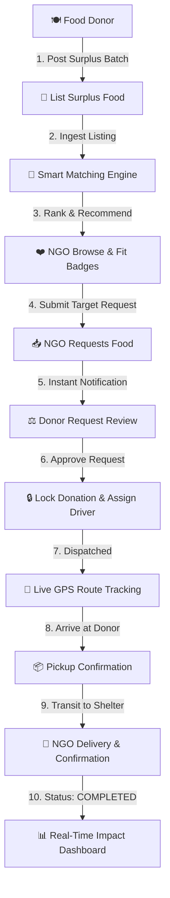

# 🍽️ ZeroPlate

<div align="center">

> *"Turning surplus food into shared meals."*

[](https://react.dev/)
[](https://www.typescriptlang.org/)
[](https://vitejs.dev/)
[](https://tailwindcss.com/)
[](https://expressjs.com/)
[](https://nodejs.org/)
[](https://vitest.dev/)
[](https://opensource.org/licenses/MIT)

</div>

---

## 📖 Table of Contents
- [Project Overview](#-project-overview)
- [Problem Statement](#-problem-statement)
- [Solution & Complete Journey](#-solution--complete-journey)
- [Key Features](#-key-features)
  - [1. Authentication & Role Management](#1-authentication--role-management)
  - [2. Food Donor Portal](#2-food-donor-portal)
  - [3. NGO Rescue Portal](#3-ngo-rescue-portal)
  - [4. AI Smart Matching Engine](#4-ai-smart-matching-engine)
  - [5. Booking & Delivery Logistics Pipeline](#5-booking--delivery-logistics-pipeline)
  - [6. Preferences & Localization (i18n)](#6-preferences--localization-i18n)
  - [7. Social & Environmental Impact Analytics](#7-social--environmental-impact-analytics)
- [High-Level Architecture](#-high-level-architecture)
- [Technology Stack](#-technology-stack)
- [Getting Started & Local Development](#-getting-started--local-development)
- [Automated Testing](#-automated-testing)
- [Demo Credentials](#-demo-credentials)
- [License](#-license)

---

## 🌟 Project Overview

**ZeroPlate** is an intelligent, dual-sided food rescue and redistribution platform designed to combat urban food waste and hunger simultaneously. It creates an automated bridge connecting commercial food businesses (restaurants, hotels, caterers, banquet halls, and households) with verified local non-profit organizations (NGOs, community shelters, soup kitchens, and orphanages).

- **Who it serves**: 
  - **Food Donors**: Commercial kitchens and donors seeking an effortless, legal, and trackable way to donate surplus edible food.
  - **NGO Managers**: Relief organizations and charities requiring timely, matched food distributions for vulnerable communities.
  - **Volunteer Logistics**: Delivery drivers and volunteers coordinating timely pickups and safe transit.
- **What problem it solves**: Eliminates communication friction, manual phone calls, and logistical bottlenecks that cause edible surplus food to end up in landfills.
- **Why it matters**: Food waste accounts for 8–10% of global greenhouse gas emissions while millions face food insecurity every day. ZeroPlate turns wasted calories into nourished lives.

---

## 🌍 Problem Statement

1. **Massive Commercial Surplus**: Restaurants, hotels, and caterers prepare food in batches, frequently producing high-quality edible surpluses at the close of service.
2. **Time-Sensitive Expiry**: Prepared food has a strict shelf-life (typically 2 to 6 hours). Without immediate matching, food degrades and must be discarded.
3. **Manual Coordination Bottlenecks**: Donors and NGOs rely on fragmented phone calls, WhatsApp groups, or ad-hoc outreach, causing delays and failed handoffs.
4. **Capacity & Dietary Mismatches**: Donors with 100 meals may reach out to shelters that can only refrigerate 20 meals, or non-veg food may be delivered to vegetarian-only facilities.
5. **Environmental & Social Toll**: Discarded organic waste generates methane in landfills, while community shelters struggle with daily food procurement budgets.

---

## 💡 Solution & Complete Journey

ZeroPlate orchestrates the entire lifecycle of surplus food rescue through an automated, real-time platform:



---

## ✨ Key Features

### 1. 🔐 Authentication & Role Management
- **Integrated Google Account Chooser**: 1-click modal sign-in with verified pre-configured accounts, bypassing standard Google OAuth origin mismatch errors during local development.
- **Email / Password & Gmail OTP**: Traditional password authentication alongside 6-digit one-time verification code login.
- **Dual-Role Architecture**:
  - **Food Donor**: Access customized for listing food batches, managing inventory, and assigning drivers.
  - **NGO Manager**: Access customized for defining food criteria, browsing nearby feeds, and requesting allocations.
- **Onboarding Gate**: Multi-step profile setup collecting organization type, contact numbers, and GPS coordinates.

---

### 2. 🍱 Food Donor Portal
- **Add Food Listing Wizard**:
  - Food title, category (Main Course, Rice, Snacks, Bakery, etc.), meal count, estimated weight.
  - Dietary classification: `VEG` or `NON-VEG`.
  - Packaging status: *Already packed*, *Needs packaging*, or *Not applicable*.
  - Pickup deadline countdown clock & GPS pickup location.
- **Donation Management Dashboard**: Filter active listings across `AVAILABLE`, `PENDING_REQUEST`, `CONFIRMED`, `RESERVED`, and `COMPLETED`.
- **NGO Request Review**: Inspect inbound food requests from nearby charities with individual match compatibility percentages, requested quantities, and custom notes.
- **Accept / Reject Actions**: Accepting locks the donation and auto-rejects competing requests.
- **Delivery Partner Assignment**: Assign internal staff, volunteers, or delivery drivers with vehicle details (Bike, Scooter, Car, Van).

---

### 3. 🤝 NGO Rescue Portal
- **Active Search Criteria**:
  - Specify required meal count, estimated weight target (kg), maximum search radius (5 km to 50 km), and dietary preference (`veg`, `non-veg`, `either`).
  - Automatically persists to `/api/ngos/requirements` and dynamically re-ranks all nearby donation listings.
- **Dual View Modes**:
  - **Interactive Radar Map View**: Color-coded GPS pins with distance concentric rings (5 km, 15 km) and live radar sweep.
  - **Ranked List View**: Clean cards with real-time match badges, urgency indicators, and meal counts.
- **Food Request Flow**: Submit requested meal counts and special pickup instructions directly to the donor.

---

### 4. 🧠 AI Smart Matching Engine

The matching engine ranks surplus food donations for NGOs using an explainable mathematical formula:

$$\text{Base Score} = (0.40 \times \text{Distance Score}) + (0.40 \times \text{Meal Compatibility}) + (0.20 \times \text{Urgency Score})$$

$$\text{Final Score} = \min(100, \text{Base Score} + \text{Premium Priority Bonus})$$

#### Mathematical Breakdown:
| Factor | Weight | Algorithm Description |
| :--- | :---: | :--- |
| **Distance Score** | **40%** | Haversine spherical distance decay from donor coordinates to NGO coordinates relative to the search radius ($100 \times [1 - \frac{d}{r_{\max}}]$). |
| **Meal Compatibility** | **40%** | Proportion of donor meal batch absorbable by NGO capacity ($\min(100, \frac{\text{capacity}}{\text{meals}} \times 100)$). |
| **Urgency Score** | **20%** | Time-decay curve prioritizing food closest to its pickup deadline ($\le 1\text{ hr} \to 100\text{ pts}$, $\ge 12\text{ hrs} \to 40\text{ pts}$). |
| **Priority NGO Boost** | **+6 pts** | Named constant bonus applied to Priority tier NGOs, mathematically bounded so distant listings cannot override urgent local food. |

- **Natural Language Explainability**: Generates dynamic narrative justifications for each match (e.g., *"Recommended because Hope Foundation is 2.9 km away, pickup needed within 2 hours, and has full capacity for all 50 meals."*).

---

### 5. 🚚 Booking & Delivery Logistics Pipeline
- **State Machine Workflow**:
  `AVAILABLE` $\to$ `PENDING_REQUEST` $\to$ `CONFIRMED` $\to$ `DELIVERY_ASSIGNED` $\to$ `PICKUP_IN_PROGRESS` $\to$ `FOOD_PICKED_UP` $\to$ `OUT_FOR_DELIVERY` $\to$ `NEAR_DESTINATION` $\to$ `DELIVERED` $\to$ `COMPLETED`
- **Driver Telemetry & ETA Calculation**: Real-time simulated telemetry tracking driver movement between donor origin and NGO destination with vehicle speed profiles.
- **Live Visual Tracking**: Interactive route pathing, progress milestones, and driver contact cards.
- **Delivery Confirmation**: One-click verified delivery completion triggering confetti animations and automatic impact metric increments.

---

### 6. ⚙️ Preferences & Localization (i18n)
- **Appearance / Theme Engine**:
  - **Light Mode**: Clean background (`#F8FAFC`) with crisp borders and soft contrast.
  - **Dark Mode**: High-contrast theme (`#0B1120` canvas, `#1E293B` cards, `#F97316` brand orange accents).
  - Persisted in `localStorage`.
- **Multi-Language Support (i18n)**: Complete UI translations across 3 languages:
  - 🇬🇧 **English (`en`)**
  - 🇮🇳 **Hindi (`hi` — हिन्दी)**
  - 🇮🇳 **Marathi (`mr` — मराठी)**
- **Account & Security Settings**:
  - Interactive Password Change modal with input validation.
  - Two-Factor Authentication (2FA) toggle.
  - Active Login Sessions security log.
  - Location services toggle.

---

### 7. 📊 Social & Environmental Impact Analytics
- **Live Impact Counters** *(Demo/Simulated Calculations)*:
  - **Total Meals Rescued**: Cumulative sum of confirmed surplus food portions.
  - **Individuals Fed**: Estimated people nourished ($\text{Meals} \times 1.1$).
  - **Food Waste Diverted**: Equivalent weight in kg ($\text{Meals} \times 0.5\text{ kg}$).
  - **Greenhouse Emissions Prevented**: Carbon footprint mitigation tracking.
- **Visual Analytics**: Interactive Recharts bar charts breaking down rescued food by category and historical activity timelines.

---

## 🏗️ High-Level Architecture

```mermaid
flowchart LR
    subgraph CLIENT ["Frontend (Client Layer)"]
        UI[React 18 + TypeScript]
        TW[Tailwind CSS + Dark Mode]
        CTX[Auth / Theme / Language Contexts]
        MATCH_CLIENT[Matching Engine + Recharts]
    end

    subgraph SERVER ["Backend (API Layer)"]
        EXPRESS[Express.js REST API]
        AUTH_ROUTER[/api/auth]
        DON_ROUTER[/api/donations]
        REQ_ROUTER[/api/requests]
        NGO_ROUTER[/api/ngos]
        BOOK_ROUTER[/api/bookings]
        DEL_ROUTER[/api/delivery]
        SUB_ROUTER[/api/subscriptions]
        IMP_ROUTER[/api/impact]
    end

    subgraph DATA ["Persistence Layer"]
        STORE[(In-Memory DB / JSON Store)]
    end

    UI --> CTX
    CTX --> TW
    UI --> EXPRESS
    EXPRESS --> AUTH_ROUTER & DON_ROUTER & REQ_ROUTER & NGO_ROUTER & BOOK_ROUTER & DEL_ROUTER & SUB_ROUTER & IMP_ROUTER
    AUTH_ROUTER & DON_ROUTER & REQ_ROUTER & NGO_ROUTER & BOOK_ROUTER & DEL_ROUTER & SUB_ROUTER & IMP_ROUTER --> STORE
```

---

## 🛠️ Technology Stack

| Layer | Technologies Used |
| :--- | :--- |
| **Frontend Framework** | React 18.3.1, TypeScript 5.7.3, Vite 6.1.0 |
| **Styling & Design** | Tailwind CSS 3.4.17, PostCSS, Autoprefixer, Lucide React Icons |
| **Data Visualization & Effects** | Recharts 2.15.1, Canvas-Confetti 1.9.4 |
| **Backend Framework** | Node.js 22.x, Express.js 4.21.2, TypeScript (`tsx` runtime) |
| **Middleware & Tools** | CORS 2.8.5, Concurrently 9.1.2, Isomorphic-Git 1.41.9 |
| **Unit Testing** | Vitest 3.0.5 |
| **Persistence** | In-Memory Database with JSON fallback (`zeroplate_db.json`) |

---

## 🚀 Getting Started & Local Development

### Prerequisites
- Node.js (v18.0.0 or higher)
- npm (v9.0.0 or higher)

### 1. Clone the Repository
```bash
git clone https://github.com/Prashant-Singh-Rawat/ZeroPlate-Hackathon.git
cd ZeroPlate-Hackathon
```

### 2. Install Dependencies
```bash
npm install
```

### 3. Start Full-Stack Application
Runs both the Express backend (`localhost:3001`) and Vite frontend (`localhost:5173`) concurrently:
```bash
npm run dev
```

### 4. Build for Production
```bash
npm run build
```

---

## 🧪 Automated Testing

ZeroPlate includes a Vitest test suite verifying the mathematical accuracy, edge-case safety, and priority rules of the Matching Engine:

```bash
npm run test
```

```
 ✓ tests/matchingEngine.test.ts (8 tests)
   ✓ calculates zero distance for identical coordinates
   ✓ gives 100% meal compatibility when capacity >= offered meals
   ✓ gives correct proportional score when capacity < offered meals
   ✓ gives high urgency score when deadline is within 1 hour
   ✓ gives lower urgency score when deadline is far away
   ✓ correctly computes weighted base match score
   ✓ applies premium priority bonus without exceeding 100
   ✓ generates clear natural language explanation

 Test Files  1 passed (1)
      Tests  8 passed (8)
```

---

## 👥 Demo Credentials

The platform is pre-seeded with sample accounts for instant evaluation:

| Portal Role | Demo Account Email | Default Name | Included Features |
| :--- | :--- | :--- | :--- |
| **🍽️ Food Donor** | `donor@spicevilla.com` | SpiceVilla Restaurant | Add Food, Listings, Request Inbox, Driver Dispatch |
| **🍽️ Food Donor (Caterer)** | `donor@greenleaf.com` | Green Leaf Cafe | Priority Tier Donor, Bulk Catering Inventory |
| **❤️ NGO Manager** | `ngo@hope.org` | Hope Foundation | Requirements Setup, Radar Map, Priority Matching |

---

## 📄 License

This project is licensed under the **MIT License** — see the [LICENSE](LICENSE) file for details.

<div align="center">
  <sub>Built with ❤️ for a hunger-free, zero-waste future.</sub>
</div>
